# super-app-process-design  

ตัดบางส่วนมาจาก https://github.com/lionants02/super-app-process-design/  

สารบัญ
1. [เรื่องข้อมูลถังแดง](scs_db/README.md)
2. [เรื่องของ Sync Lookup](sync_loockup/README.md)
3. [การ Bakcup ข้อมูลรายวัน](daily_sync/README.md)

Note กระบวนการ SCS DB  
---
ช่วงเวลาที่ตกลงกัน

---
ช่วงเวลาที่ระบบทำงาน

```mermaid
gantt
    dateFormat HH:mm
    axisFormat %H:%M
    section ถังแดง SCS
    ส่งเข้าSCS : 00:00, 04:00
    Dashboard ส่งเข้าSCS ประมวลผล : 00:00, 04:00
    SCS, OSR ประมวลผล: 06:00, 15:00
    รับข้อมูลกลับ : 15:10, 21:00
    Dashboard รับข้อมูลกลับ ประมวลผล : 15:10, 21:00
```
