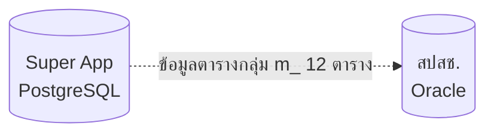

# Backup ข้อมูล Super App รายวัน

ประมวลผลทุกวันเวลา `22:00 น.`

## รายชื่อตาราง
1. m_register_std
    - check 01-05-2024 ฟิวด์ยังคงเดิม + แก้ error ขนาดความยาวฟิวด์เปลี่ยนแล้ว
2. m_diagnosis_std
    - check 01-05-2024 ฟิวด์ยังคงเดิม + ปรับ type timestamp
3. m_impairment_std
    - check 01-05-2024 ฟิวด์ยังคงเดิม
4. m_mental_std
    - check 01-05-2024 ฟิวด์ยังคงเดิม + แก้เรื่องการปัดเศษตัวเลข QTY เนื่องจาก type ตัวเลขไม่ตรงตามชนิด
5. m_serviceitem_std
    - check 01-05-2024 ฟิวด์ยังคงเดิม
6. m_pregnancy_std
    - check 01-05-2024 ฟิวด์ยังคงเดิม
7. m_procedure_std
    - check 01-05-2024 ฟิวด์ยังคงเดิม
8. m_refer_std
    - check 01-05-2024 ฟิวด์ยังคงเดิม
9. m_serv_std
    - check 01-05-2024 ฟิวด์ยังคงเดิม
10. m_appeal
    - check 01-05-2024 ฟิวด์ยังคงเดิม
11. m_process_result
    - check 01-05-2024 มีฟิวด์เพิ่มขึ้นมา + ปรับโครงสร้างแล้ว + เพิ่ม database comment ตาม pgsql
12. m_payment_result
    - check 01-05-2024 มีฟิวด์เพิ่มขึ้นมา + ปรับโครงสร้างแล้ว + ปรับ type timestamp

## โครงสร้าง
เดี๊ยวต้องเช็คดู โครงสร้างมีการปรับเปลี่ยนจากตอนที่ทำไว้ตอนแรก