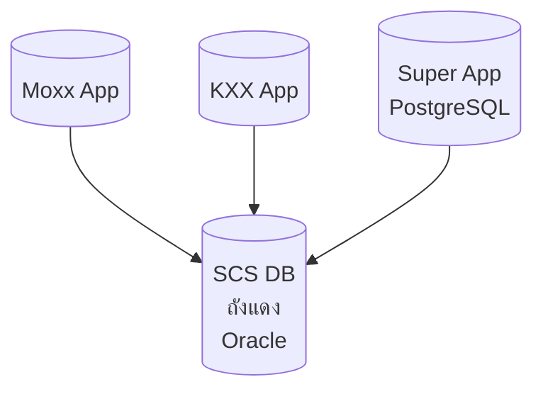
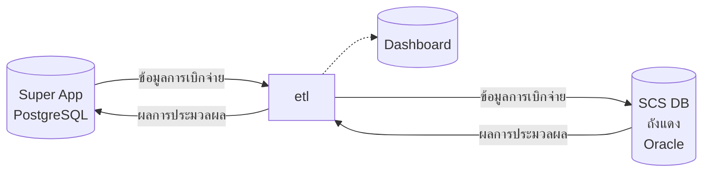
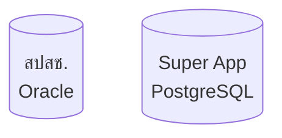

- [ถังแดง สปสช.](#ถังแดง-สปสช)
- [การเชื่อมข้อมูลถังแดง สปสช. กับ Super App](#การเชื่อมข้อมูลถังแดง-สปสช-กับ-super-app)
  - [การปรับปรุง และ การแก้ไขโปรแกรม](#การปรับปรุง-และ-การแก้ไขโปรแกรม)
  - [Database ที่ใช้](#database-ที่ใช้)
  - [Note บันทึกสิ่งที่ทำ](#note-บันทึกสิ่งที่ทำ)

# ถังแดง สปสช.

เป็นฐานข้อมูลกำเบิกจ่ายกลางของ สปสช. เพื่อเช็คความซ้ำซ้อนของการส่งเบิก และ ติดตามข้อมูลการส่งเบิกแต่ละระบบ โดย`โครงสร้างพื้นฐานจะเป็น 13 แฟ้ม` โดยจะมี`แฟ้มพิเศษอีก 2 แฟ้ม`สำหรับการเบิกจ่ายคือ
1. `NHSO_PAY_RESULT` ข้อมูลการเบิกจ่าย หากต้องการส่งเรื่องเบิกจ่ายใน `NHSO_CHAD` รายการไหนต้องใส่ข้อมูลอ้างอิงไว้ที่ `NHSO_PAY_RESULT` ด้วย อาจจะดูอ้างอิงจากเอกสารแก้บัค [fixbug_ITEM_CODE](fix/fixbug_ITEM_CODE.md)
2. `NHSO_INSCL` ข้อมูลสิทธิการรักษาที่ใช้

# การเชื่อมข้อมูลถังแดง สปสช. กับ Super App

จะเชื่อมด้วย ETL โดยจะทำงานตามเวลาที่มีการตกลงกับทาง สปสช.
- `00:00 - 06:00` รอบส่งข้อมูลการเบิกจ่ายต้องทำให้เสร็จในช่วงนี้
- `หลัง 15:05` รับข้อมูลการประมวลผลกลับ

```mermaid
gantt
    dateFormat HH:mm
    axisFormat %H:%M
    section ถังแดง SCS
    ช่วงเวลาที่อนุญาตให้ ส่งเข้าSCS : 00:00, 06:00
    SCS, OSR ประมวลผล: 06:00, 15:00
    ช่วงเวลาที่อนุญาตให้ รับข้อมูลกลับ : 9h
```

## การปรับปรุง และ การแก้ไขโปรแกรม
- [NHSO_PAY_RESULT.AMOUNT_PAID การคำนวนราคาเบิกจ่าย](fix/AMOUNT_PAID.md)
- [NHSO_PAY_RESULT.ITEM_CODE การแมพค่าระหว่าง LOCALCODE ในตัว Super App กับถังแดง](fix/fixbug_ITEM_CODE.md)

## Database ที่ใช้

ฐานข้อมูลทั้ง 2 ฐานนอกจากจะใช้ DBMS(ระบบจัดการฐานข้อมูล) คนละอย่าง ยังมีโครงสร้างกันคนละแบบด้วย
- สปสช. ใช้ฐานข้อมูล Oracle `โครงสร้างอิงตาม 13 แฟ้ม`
- Super App ใช้ฐานข้อมูล PostgreSQL `โครงสร้างของ Super App`

## Note บันทึกสิ่งที่ทำ
1. ทำการแมพฟิวด์ข้อมูลระหว่าง Super App และ ถังแดง
   - เอกสารการแพมฟิวด์ ถังแดง กับ Super App
2. หาความสัมพันธ์เชิงโครงสร้างระหว่างโครงสร้าง Super App และ ถังแดง
   - [เอกสารการความสัมพันธ์ ระหว่างโครงสร้าง](relation.md)
3. ออกแบบโฟลสำหรับการประมวลผล
   - [เอกสารการออกแบบโฟลการประมวผล การนำส่งข้อมูล](super-app-to-srs.md)
   - [เอกสารการออกแบบโฟลการประมวผล การรับผลการประมวลผล](srs-to-super-app.md)
4. ทำ Dashboard debug สำหรับติดตามการส่งข้อมูล และ การนำเข้าข้อมูล
   - [เอกสารการออกแบบ Dashboard](scs-dashboard.md)

