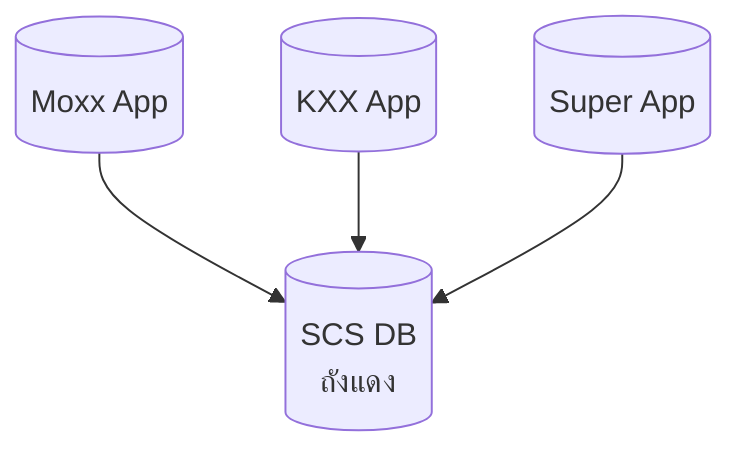
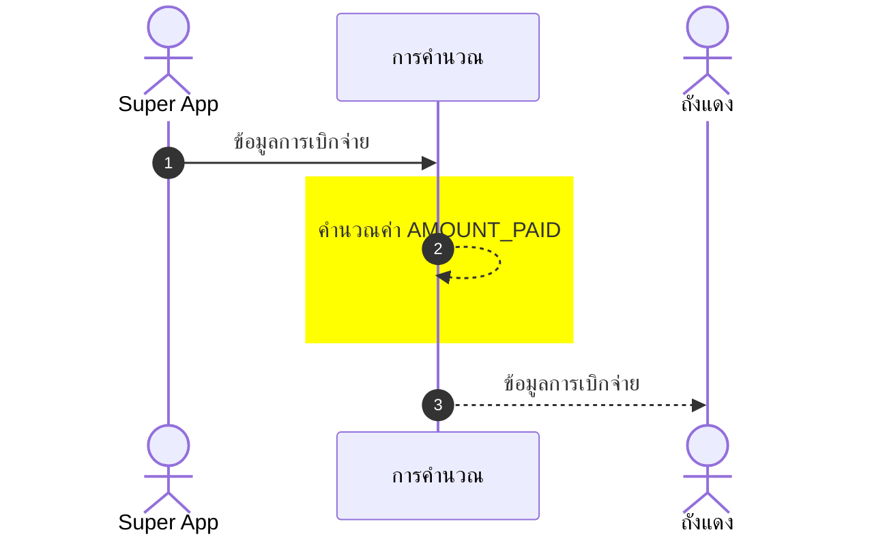
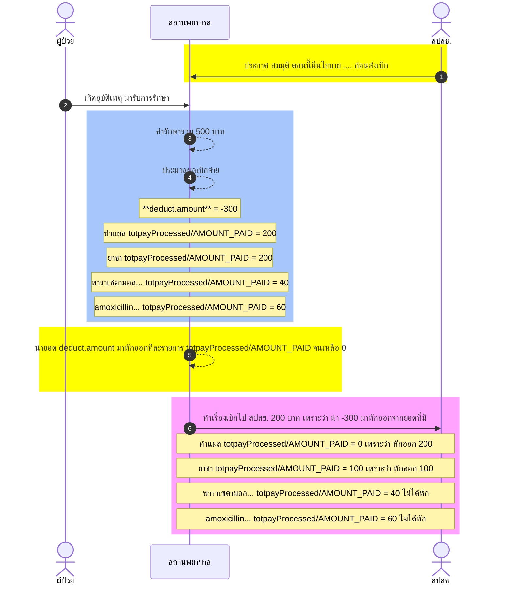

# สารบัญ
- [สารบัญ](#สารบัญ)
- [SCS DB(ถังแดง) คือ](#scs-dbถังแดง-คือ)
- [การคำนวณหาเงินที่จ่ายตอนส่งเบิกระหว่าง SCS DB(ถังแดง) กับ Super APP](#การคำนวณหาเงินที่จ่ายตอนส่งเบิกระหว่าง-scs-dbถังแดง-กับ-super-app)
  - [ความหมายความเป็นมา](#ความหมายความเป็นมา)
  - [สาเหตุที่ต้องทำการคำนวณค่าใหม่](#สาเหตุที่ต้องทำการคำนวณค่าใหม่)

# SCS DB(ถังแดง) คือ
เป็นฐานข้อมูลกำเบิกจ่ายกลางของ สปสช. เพื่อเช็คความซ้ำซ้อนของการส่งเบิก และ ติดตามข้อมูลการส่งเบิกแต่ละระบบ

# การคำนวณหาเงินที่จ่ายตอนส่งเบิกระหว่าง SCS DB(ถังแดง) กับ Super APP

## ความหมายความเป็นมา  
เนื่องจากโครงสร้างฐานข้อมูล Super App ถูกพัฒนามาก่อนที่โครงสร้าง SCS DB(ถังแดง) จะประกาศใช้ จึงจำเป็นต้องทำการแปลงโครงสร้างให้อยู่ในรูปแบบของ SCS DB(ถังแดง) ก่อน   
- Super App ฐานข้อมูล Super App  
    ตารางฐานข้อมูลที่ใช้จะมี `eclaimowner.m_process_result` ตารางเดียว
  - ฟิวด์ที่เกี่ยวข้อง
    - `eclaimowner.m_process_result.m_serv_result` รายการผลของการประมวลผลเบิกจ่ายจาก Super App แยกตาม `localcode` และ `subFund`
      - `totpayProcessed/AMOUNT_PAID` ที่จ่าย
      - `subFund`
      - `localcode` แยกตาม local code
    - `eclaimowner.m_process_result.deduct` ผลการประมวลผลยอดที่มีการหักออกสำหรับการเบิกจ่าย Super App
      - `amount` จำนวนที่ต้องหักออกจากรายการ `m_serv_result.totpayProcessed/AMOUNT_PAID` เป็นตามสมการ $` จำนวนเงินที่ส่งเบิก\ สปสช. = totpayProcessed - amount`$ โดยนำแต่ละรายการใน `m_serv_result` มาหักออกด้วย `amount` จนกว่าค่า `amount` จะเป็น 0
      - `subfund`
      - `is_paid_by_nhso` จ่ายโดย สปสช. ต้องเป็น `true`

- SCS DB(ถังแดง)  
    ในที่นี้จะเจาะจงเฉพาะฟิวด์ `SCS_OWNER.NHSO_PAY_RESULT.AMOUNT_PAID` ที่เป็นการกำหนดเงินที่จ่าย โดยถ้าเกิดเป็นการเหมาะจ่ายจะเป็น 0  
  - ฟิวด์ที่เกี่ยวข้อง
    - `SCS_OWNER.NHSO_PAY_RESULT.AMOUNT_PAID` ที่เป็นการกำหนดเงินที่จ่าย โดยถ้าเกิดเป็นการเหมาะจ่ายจะเป็น 0

## สาเหตุที่ต้องทำการคำนวณค่าใหม่
เนื่องจากบางครั้งมีเงื่อนไขการเบิกจ่ายจากกองทุน เช่น ถ้าตรงเงื่อนไข__<u>aaa</u>__ให้เหมาจ่ายส่วนนี้ได้ __<u>xxx</u>__บาท

    เช่น  สมมุติผู้ป่วยมารับบริการ มีรายการดังนี้  
  1. ค่าทำแผล 200 บาท
  2. ค่ายาชา 200 บาท
  3. พาราเซตามอล 500 mg จำนวน 1 กระปุ๋ก 40 บาท
  4. ยาฆ่าเชื้อ amoxicillin 500 mg 1 แผง 60 บาท

  รวม 500 บาท  
  แล้วตรงกับเงื่อนไขพิเศษบางอย่างที่บอกว่า ในรายการนี้ให้เบิกได้ **\_\_<u>200</u>\_\_** บาท  
   ฟิวด์ `eclaimowner.m_process_result.deduct` จะได้ค่าออกมาเป็น **$-300$**

