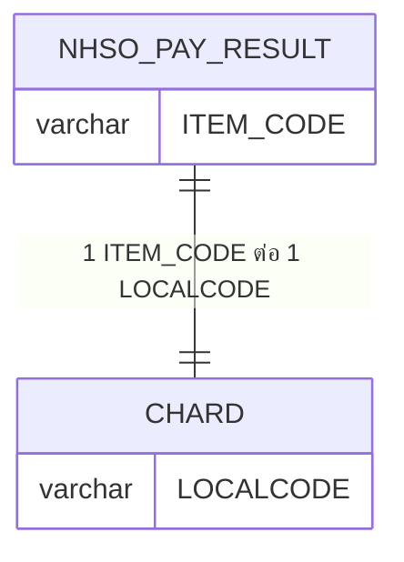
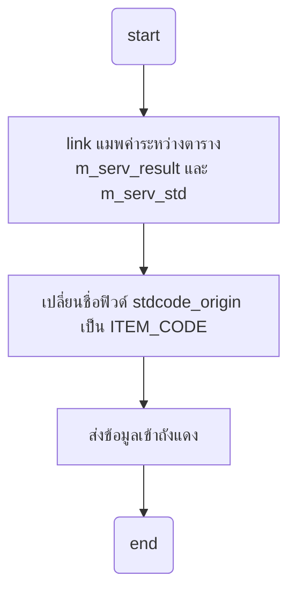
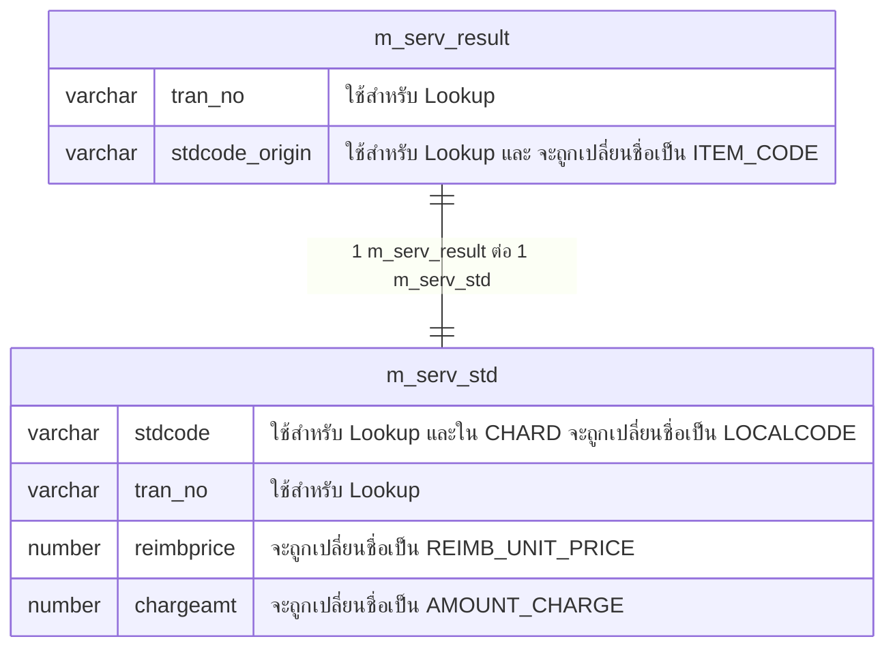

- [Bug เกิดจาก](#bug-เกิดจาก)
- [การหา ITEM\_CODE จากฐาน Super App](#การหา-item_code-จากฐาน-super-app)
  - [สร้าง ITEM\_CODE ในแฟ้ม NHSO\_PAY\_RESULT](#สร้าง-item_code-ในแฟ้ม-nhso_pay_result)

# Bug เกิดจาก
เนื่องจากมีการปรับแก้หน้างาน โดยการเปลี่ยนการแมพฟิวด์ระหว่างตารางของ Super App จาก `localcode` เป็น `stdCode` เพื่อออกไปยังถังแดง ยังไม่ได้ผ่านการทดสอบ ทำให้ค่าที่ทางเดฟผู้ดูแลฐานบอกมาเป็นค่าข้อมูล ที่ไม่สามารถทำการเชื่อมโยงหากันได้ ส่งผลให้ข้อมูลส่งออกไปไม่ครบ

# การหา ITEM_CODE จากฐาน Super App
คอนเซ็ป

ค่าเดียวกันจะถูกใช้ใน 2 ฟิวด์ที่มีค่าเดียวกัน คือ
- ฟิวด์ `ITEM_CODE` จะถูกใช้ในแฟ้ม `NHSO_PAY_RESULT`
- ฟิวด์ `LOCALCODE` จะถูกใช้ในแฟ้ม `CHARD`

## สร้าง ITEM_CODE ในแฟ้ม NHSO_PAY_RESULT

**คอนเซปจะต้องทำการ link 2 ตารางนี้เข้าด้วยกันด้วยค่า `m_serv_result.stdcode_origin` กับ `m_serv_std.stdcode`**  

- `m_serv_result` ฟิวด์ส่วนใหญ่จะถูกแปลงค่าเป็น `NHSO_PAY_RESULT`
- `m_serv_std` ฟิวด์ส่วนใหญ่จะถูกแปลงค่าเป็น `CHARD`

