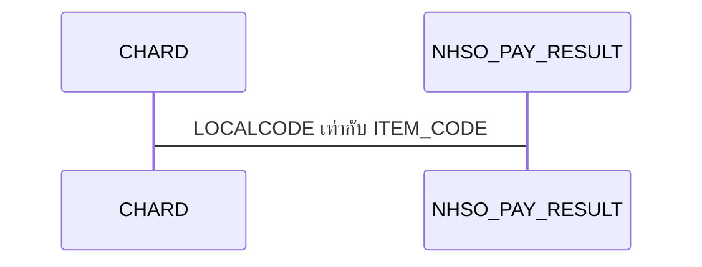
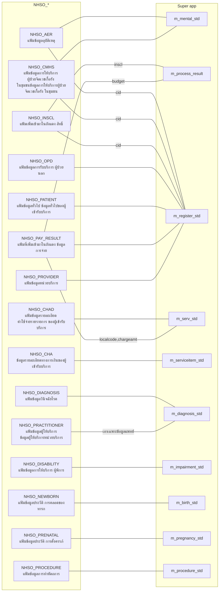

- [ความสัมพันธ์](#ความสัมพันธ์)
  - [ความสัมพันธ์ของตาตรางฝั่ง NHSO\_](#ความสัมพันธ์ของตาตรางฝั่ง-nhso_)
  - [diagram ความสัมพันธ์คร้าว ๆ](#diagram-ความสัมพันธ์คร้าว-ๆ)

# ความสัมพันธ์
## ความสัมพันธ์ของตาตรางฝั่ง NHSO_

## diagram ความสัมพันธ์คร้าว ๆ

