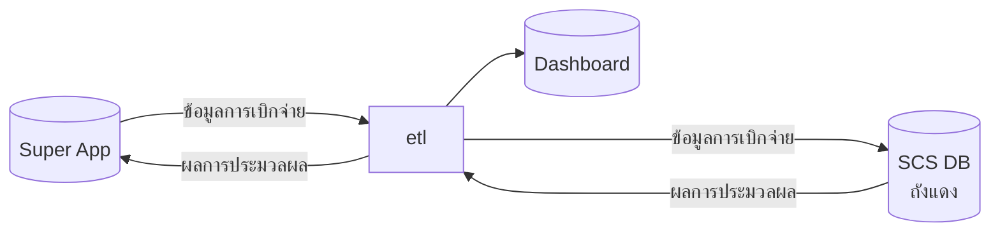
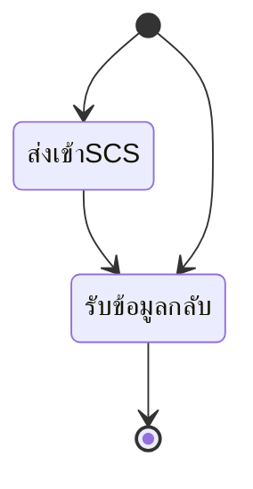

- [Dashboard แสดงผลการรับส่งข้อมูลระหว่าง SCS DB(ถังแดง) และ Super App](#dashboard-แสดงผลการรับส่งข้อมูลระหว่าง-scs-dbถังแดง-และ-super-app)
  - [ข้อมูลที่ต้องติดตาม](#ข้อมูลที่ต้องติดตาม)
  - [ค่าคงที่สถานะ state ของข้อมูล](#ค่าคงที่สถานะ-state-ของข้อมูล)

# Dashboard แสดงผลการรับส่งข้อมูลระหว่าง SCS DB(ถังแดง) และ Super App



เนื่องจากเป็นข้อมูลที่เกี่ยวข้องกับการเบิกจ่าย จำเป็นต้องมี Dashboard แสดงผลการส่งข้อมูลเพื่อที่ให้สะดวกเวลาติดตามข้อมูล


## ข้อมูลที่ต้องติดตาม
1. ติดตามสถานะการส่งข้อมูลของ NHSO_PAY_RESULT
   1. นับ `REFERENCE_ID` แยกตาม เวลาที่ส่ง
    ```mermaid
    erDiagram
        main {
        string time PK "เวลารอบการทำงาน"
        string state PK "ค่าคงที่ 'ส่งเข้าSCS'"
        int count "นับว่ามีกี่ REFERENCE_ID กรุปตามเวลา"
    }
    ```
   2. นับแยกตาม `HCODE` มีกี่รายการ
    ```mermaid
    erDiagram
        main_hcode {
        string hcode PK "รหัส hcode"
        string time PK "เวลารอบการทำงาน"
        string state PK "ค่าคงที่ 'ส่งเข้าSCS'"
        int count "นับว่ามีกี่ REFERENCE_ID"
    }
    ```

   3. นับว่ามีกี่แถวรายการ `REFERENCE_ID` แยกตาม `รหัสสถานพยาบาล(HCODE)` ไม่ต้องทำ
    ```mermaid
    erDiagram
        main_log_reference_id {
        string hcode PK "รหัส hcode"
        string time PK "เวลารอบการทำงาน"
        string state PK "ค่าคงที่ 'ส่งเข้าSCS'"
        int count "sum จาก ข้อ 4 นับ มีกี่แถวข้อมูลจริง"
    }
    ```
    4. มี `REFERENCE_ID` , `ITEM_CODE` อะไรที่ส่งผ่านขั้นตอนนี้บ้าง
    ```mermaid
    erDiagram
        main_log_reference_id {
        string hcode PK "รหัส hcode"
        string reference_id PK "ค่า REFERENCE_ID"
        string item_code PK "ค่า item_code"
        string time PK "เวลารอบการทำงาน"
        string state PK "ค่าคงที่ 'ส่งเข้าSCS'"
        int count "มีกี่แถวชุดข้อมูล ใส่ไว้เผื่อแทร็คบัค จริงๆ จะเท่ากับ 1 เท่านั้น"
    }
    ```
2. ติดตามสถานะการ `รับข้อมูลกลับ` ตามกรอบการทำงานแบบเดียวกับ `ส่งเข้าSCS` ลงในตารางชุดเดิมโดยใส่ค่า `state` เป็น `รับข้อมูลกลับ`
   1. ในข้อ 3 จะไม่มีข้อมูลเกิดขึ้น ค่าจะเท่ากับ ตาราง 4 ใหม่
   2. ในส่วนข้อที่ 4 ที่บอกว่า **"มี `REFERENCE_ID` , `ITEM_CODE` อะไรที่ส่งผ่านขั้นตอนนี้บ้าง"** ตัดออก ให้เปลี่ยนเป็นตารางชุดใหม่ที่มีการบอก `STATUS` แต่ละ `REFERENCE_ID` ที่กลับมา
   3. ตารางที่ 4 ชุดใหม่ มี `REFERENCE_ID` , `STATUS` อะไรที่ส่งผ่านขั้นตอนนี้บ้าง  
        ```mermaid
        erDiagram
            main_log_reference_id_recive {
            string hcode PK "รหัส hcode"
            string reference_id PK "ค่า REFERENCE_ID"
            string status PK "ค่า STATUS"
            string time PK "เวลารอบการทำงาน จะอิงกับ UPDATE_DATE"
            string state PK "ค่าคงที่ 'รับข้อมูลกลับ'"
            int count "มีกี่แถวชุดข้อมูล ใส่ไว้เผื่อแทร็คบัค จริงๆ จะเท่ากับ 1 เท่านั้น"
        }

## ค่าคงที่สถานะ state ของข้อมูล
ค่า state ที่จะเป็นไปได้ในแต่ละชุดข้อมูล
 - `ส่งเข้าSCS` คือ ข้อมูลที่อยู่ในกลุ่มที่จะถูกส่งเข้า `SCS` 
 - `รับข้อมูลกลับ` คือ ข้อมูลที่รับการประมวลผลกลับมาจาก `SCS`
