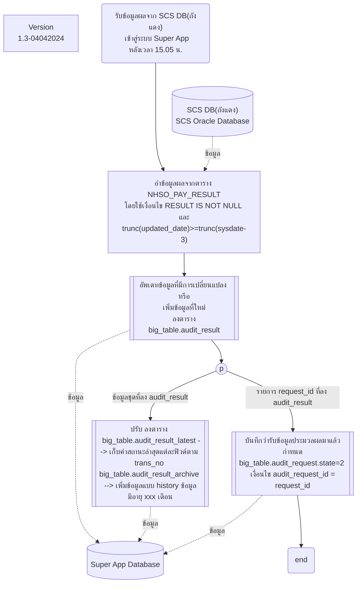
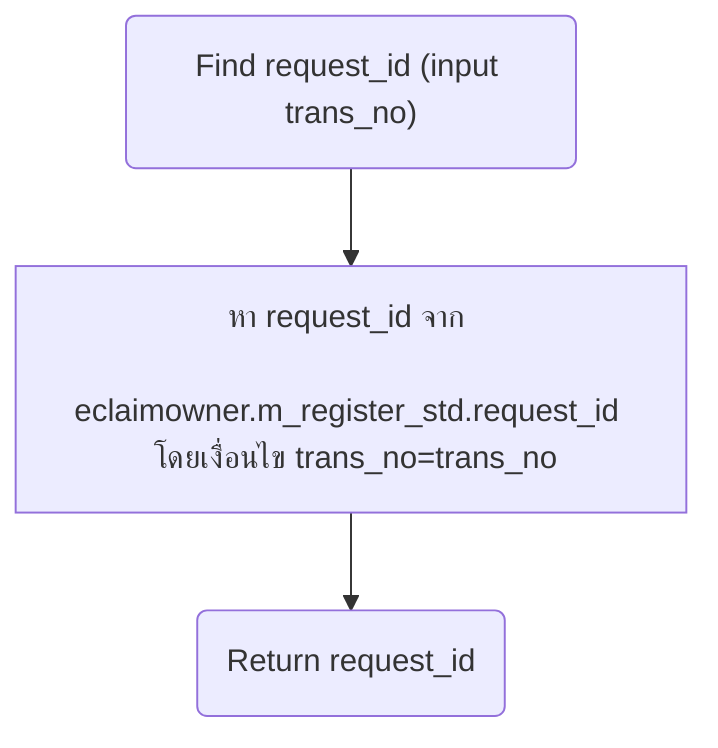
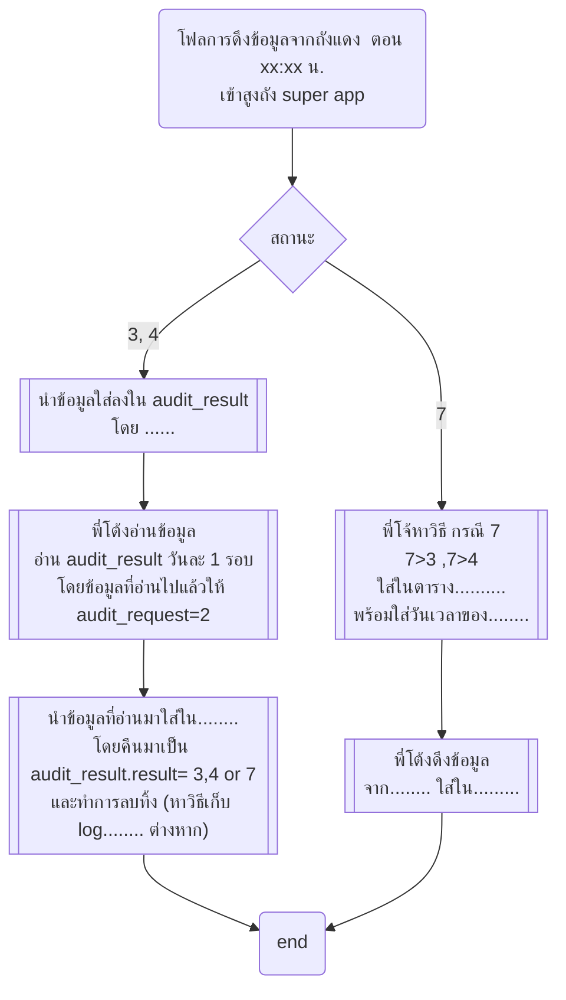

# การดึงข้อมูลกลับจากถังแดง

- [การดึงข้อมูลกลับจากถังแดง](#การดึงข้อมูลกลับจากถังแดง)
  - [โฟลการทำงาน](#โฟลการทำงาน)
    - [โฟลตาราง NHSO\_PAY\_RESULT ขากลับเข้า Super App](#โฟลตาราง-nhso_pay_result-ขากลับเข้า-super-app)
      - [โฟลการหา request\_id จาก trans\_no](#โฟลการหา-request_id-จาก-trans_no)
  - [ภาคผนวก](#ภาคผนวก)
    - [โฟล์กลับจากถังแดงที่เคยคุยกับพี่โต้งพี่แอร์เก่า](#โฟล์กลับจากถังแดงที่เคยคุยกับพี่โต้งพี่แอร์เก่า)

## โฟลการทำงาน

### โฟลตาราง NHSO_PAY_RESULT ขากลับเข้า Super App

#### โฟลการหา request_id จาก trans_no
    ด้านบนต้องใช้  

## ภาคผนวก

### โฟล์กลับจากถังแดงที่เคยคุยกับพี่โต้งพี่แอร์เก่า
เป็นโฟลตัวเก่าที่คุยในครั้งแรก
