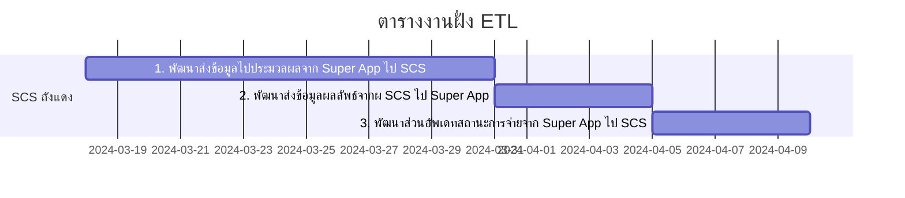
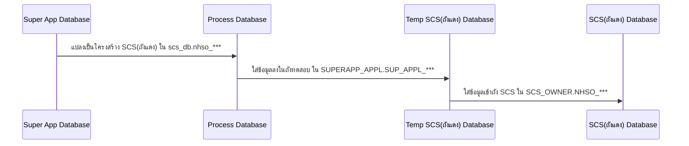
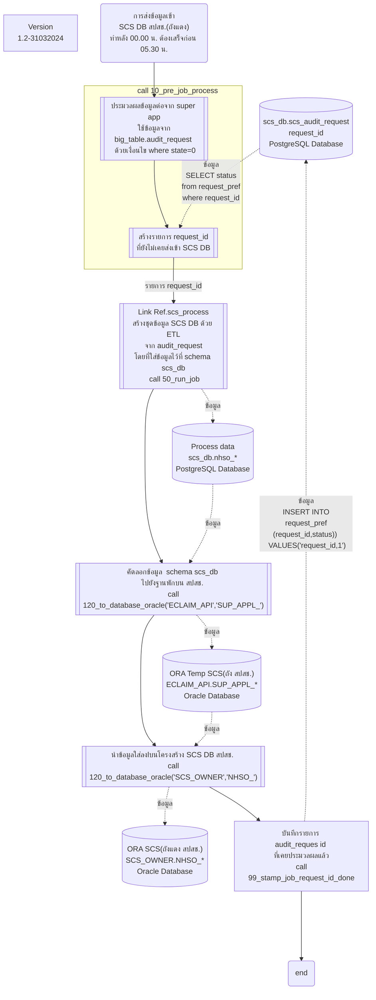
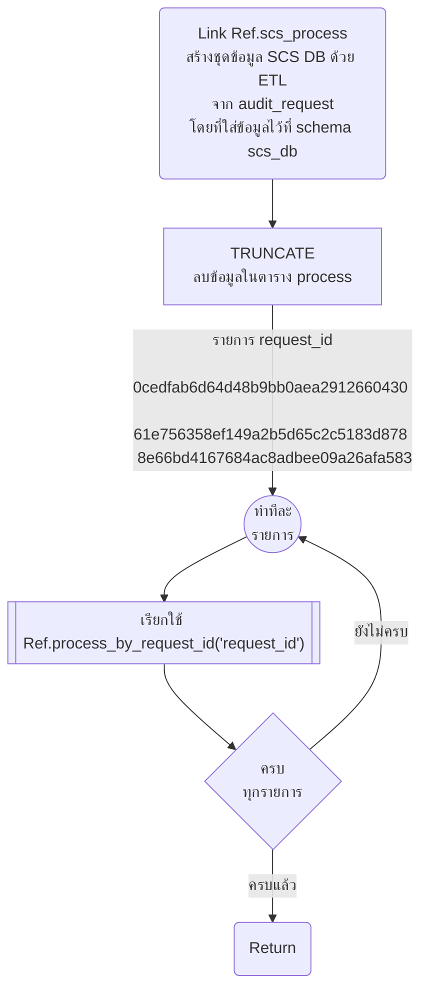
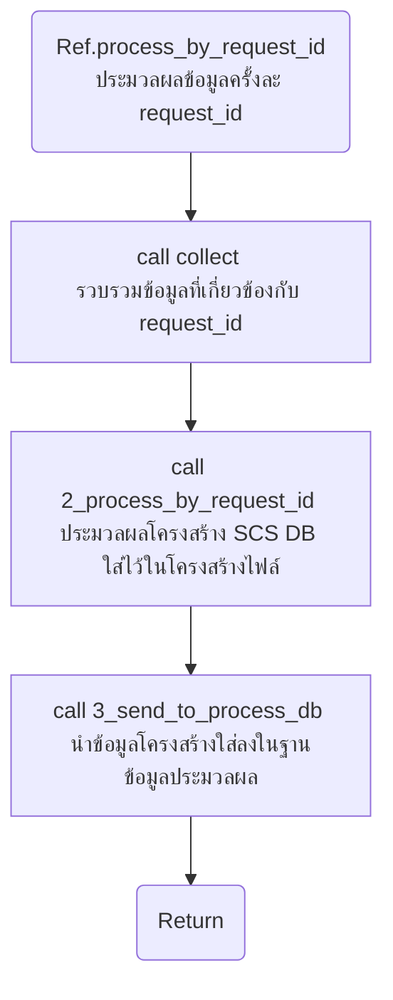
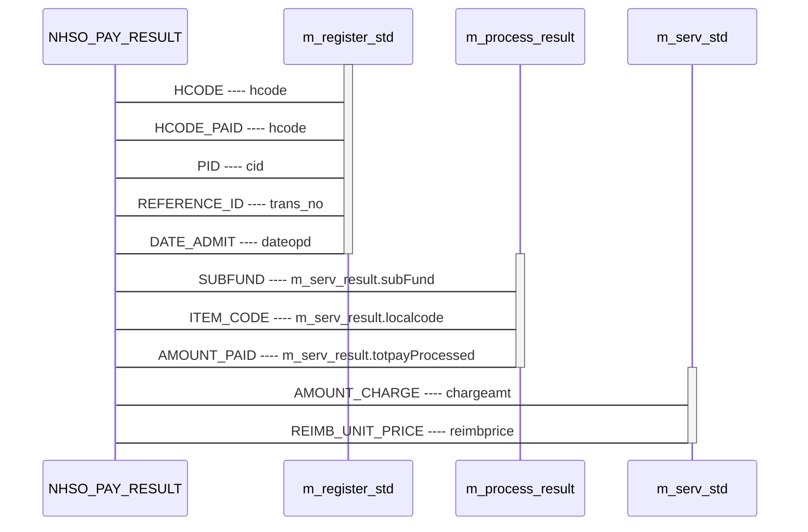
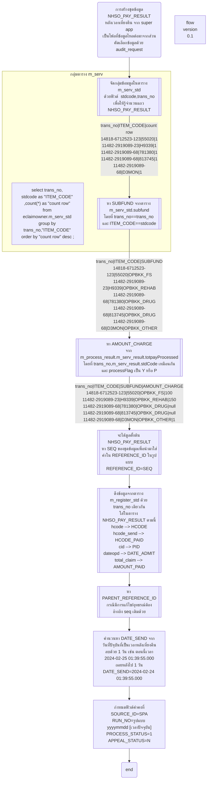
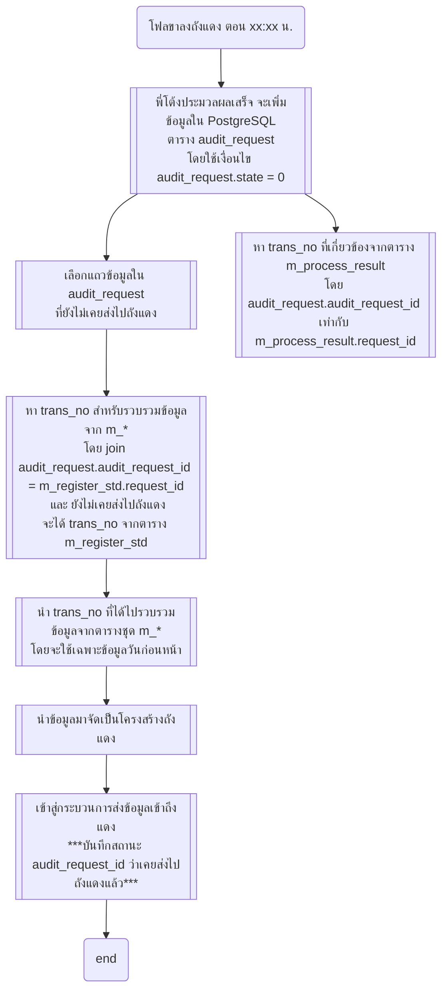

# การนำข้อมูล super app ขึ้นไปถัง Oracle SCS

- [การนำข้อมูล super app ขึ้นไปถัง Oracle SCS](#การนำข้อมูล-super-app-ขึ้นไปถัง-oracle-scs)
  - [โฟลภาพรวม](#โฟลภาพรวม)
    - [ภาพการไหลของข้อมูลเข้าแต่ละ Database](#ภาพการไหลของข้อมูลเข้าแต่ละ-database)
    - [โฟลการไหลข้อมูลเข้า SCS DB ถังแดง](#โฟลการไหลข้อมูลเข้า-scs-db-ถังแดง)
      - [Ref.scs\_process](#refscs_process)
      - [Ref.process\_by\_request\_id](#refprocess_by_request_id)
    - [ภาพความสัมพันธ์การเกิดข้อมูล NHSO\_PAY\_RESULT กับ Super App](#ภาพความสัมพันธ์การเกิดข้อมูล-nhso_pay_result-กับ-super-app)
    - [โฟลตาราง NHSO\_PAY\_RESULT ขานำข้อมูลจาก Super App มาใส่](#โฟลตาราง-nhso_pay_result-ขานำข้อมูลจาก-super-app-มาใส่)
  - [ภาคผนวก](#ภาคผนวก)
    - [โฟลเงื่อนไขการการเริ่มการทำงาน ว่าจะประมวลผลข้อมูลจากข้อมูลชุดใด](#โฟลเงื่อนไขการการเริ่มการทำงาน-ว่าจะประมวลผลข้อมูลจากข้อมูลชุดใด)

## โฟลภาพรวม

### ภาพการไหลของข้อมูลเข้าแต่ละ Database

### โฟลการไหลข้อมูลเข้า SCS DB ถังแดง

#### Ref.scs_process
    อ้างอิงเป็น subfunction มาจากโฟลหลัก

#### Ref.process_by_request_id  
    อ้างอิง subfunction จากอันบน

### ภาพความสัมพันธ์การเกิดข้อมูล NHSO_PAY_RESULT กับ Super App

### โฟลตาราง NHSO_PAY_RESULT ขานำข้อมูลจาก Super App มาใส่

## ภาคผนวก

### โฟลเงื่อนไขการการเริ่มการทำงาน ว่าจะประมวลผลข้อมูลจากข้อมูลชุดใด
    คุยกับพี่โต้ง พี่แอร์ เกี่ยวกับเงื่อนไขการประมวลผล ไม่ได้ใช้แล้ว เป็นบันทึกเฉยๆ
